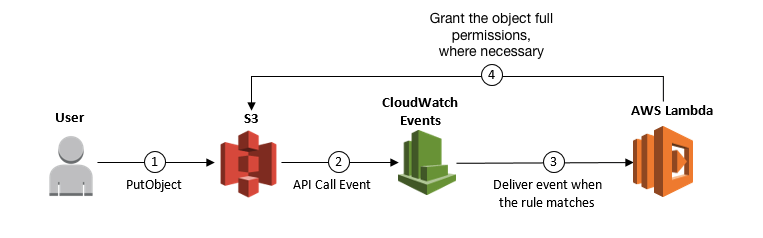

#  Cross Account S3 Object ACL Update

# Diagram


## Requirements/Prerequisites

* AWS CLI already configured with Administrator permission
* [Install SAM CLI](https://docs.aws.amazon.com/serverless-application-model/latest/developerguide/serverless-sam-cli-install.html) if you do not have it.
* [AWS-MFA](https://github.com/broamski/aws-mfa)
* Manually create source account IAM role with S3 permissions to `PutObjectAcl` on destination account's S3 Buckets (Example Below)
* Manually create a [Slack Webhook](https://slack.com/help/articles/115005265063-Incoming-webhooks-for-Slack)
* Manually create an SSM Parameter per account called `/<env>/slack_webhook/aws_alerts/LAMBDA_ALERTS` set as type `secureString` with the webhook url from above as the value

#### Source Account IAM Role Trust Relationship Example
This trust policy will allow the lambda's from any destination account you specify to assume the role and perform the `PutObjectAcl` on the S3 object

```json
{
  "Version": "2012-10-17",
  "Statement": [
    {
      "Sid": "",
      "Effect": "Allow",
      "Principal": {
        "AWS": "arn:aws:iam::<destination Account #>:root",
        "AWS": "arn:aws:iam::<destination Account #>:root"
      },
      "Action": "sts:AssumeRole"
    }
  ]
}

```

#### Source Account IAM Role Example
This role will be assumed by the destination account's lambda so that the object owner (this account) can grant the destination account full permissions of the object

```json
{
    "Version": "2012-10-17",
    "Statement": [
        {
            "Action": [
                "s3:PutObjectAcl"
            ],
            "Resource": [
                "Resource": "arn:aws:s3:::<Target Account S3 Bucket>/*",
                "Resource": "arn:aws:s3:::<Target Account S3 Bucket>/*",
                "Resource": "arn:aws:s3:::<Target Account S3 Bucket>/*"
                ],
            "Effect": "Allow"
        }
    ]
}

```

## Installation & Deployment Instructions

Clone the repo onto your local development machine using `git clone <repo url>`.

1. Open samconfig.toml and edit the following lines per the account you are deploying to.
```
s3_bucket = "<bucket-name>"
parameter_overrides = "EnvironmentParam=\"<env>\""
```

2. Run the below commands to deploy the template
```
aws-mfa to the Destination Account & Set Your Profile

sam deploy

```
The lambda function will immediately start getting events from the S3 buckets if new items are added, and if necassary update the objects permissions